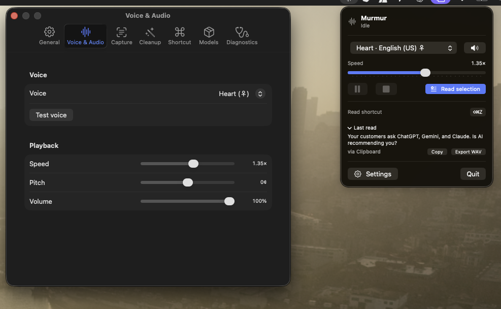

# Murmur

**Fluid Voice, but for text-to-speech.** Highlight text anywhere on macOS, press a hotkey, hear it read aloud in a high-quality local [Kokoro](https://github.com/hexgrad/kokoro) voice. Fully local, fully private — no cloud, no account, no tracking.



```bash
git clone https://github.com/latent-variable/Murmur.git
cd Murmur && bash scripts/build_app.sh && open dist/Murmur.app
```

First launch downloads the Kokoro model (~340 MB) and builds a Python venv automatically. Grant Accessibility when prompted, then select text in any app and press **⌘⇧R**.

## What it does

- **Read from anywhere** — Chrome, Safari, PDFs, Terminal, VS Code, Notes, Slack, Gmail, Markdown. Selected-text capture via the Accessibility API, with a clipboard-copy fallback that restores your clipboard.
- **54 local voices**, 8 languages (English US/UK, Spanish, French, Italian, Hindi, Japanese, Portuguese, Chinese). Apple-Silicon accelerated.
- **Streaming playback** — audio starts while the rest is still synthesizing. Play / pause / stop, speed, pitch, volume.
- **Smart cleanup** — strips Markdown, code fences, citations, terminal prompts, and more before speaking. Profiles for General / Markdown / Code / Blog / LLM output, plus editable regex rules with live preview.
- **Menu-bar utility** — status indicator (idle / loading / reading / paused / error), quick controls, settings. No dock icon.

## Architecture

Native SwiftUI menu-bar app + a local Python Kokoro sidecar over `127.0.0.1`.

```
SwiftUI app ──HTTP──> FastAPI sidecar ──> kokoro-onnx (ONNX Runtime, Apple Silicon)
  hotkey · capture · cleanup · audio        streaming int16 PCM @ 24 kHz
```

- `backend/server.py` — `/health`, `/voices`, `/synthesize` (streams PCM; `?format=wav` for export).
- `app/Sources/Murmur/` — hotkey (Carbon), capture (AX + clipboard), preprocessing, AVAudioEngine player, settings, views.

Why a Python sidecar: Kokoro's reference runtime is Python, and `kokoro-onnx` gives fast local inference with no PyTorch. The app supervises it, keeps it warm, and reuses an already-running instance.

## Develop

```bash
# backend only (auto-creates venv on first run)
bash scripts/run_backend.sh

# build + run the app
bash scripts/build_app.sh && open dist/Murmur.app

# run the preprocessing self-test
cd app && swift build && "$(swift build --show-bin-path)/Murmur" --selftest
```

Models live in `~/Library/Application Support/Murmur/models`. The venv lives in `~/Library/Application Support/Murmur/venv`.

## Models / voices

Auto-downloaded on first run from the [kokoro-onnx releases](https://github.com/thewh1teagle/kokoro-onnx/releases). To do it manually:

```bash
cd backend && source "$HOME/Library/Application Support/Murmur/venv/bin/activate"
python download_models.py
```

## Permissions

| Permission | Why | When |
|---|---|---|
| **Accessibility** | Read selected text directly; synthesize ⌘C for the fallback | Prompted on first read; grant in Settings ▸ Privacy ▸ Accessibility |

No microphone, no network (after the one-time model download), no input monitoring beyond the registered global hotkey.

## Known limitations

- Ad-hoc signed — first launch needs right-click ▸ Open (no notarization yet).
- Pitch is a post-process shift (AVAudioUnitTimePitch); Kokoro has no native pitch control.
- Accessibility selected-text capture varies by app; unreliable apps fall back to clipboard automatically (shown in Diagnostics).
- Requires Python 3.12 available for the first-run venv build.

## Roadmap

- [ ] Bundle a relocatable Python runtime; notarize + DMG.
- [ ] Per-app capture overrides and audio caching.
- [ ] Floating draggable mini-player window.
- [ ] CoreML execution provider toggle.
- [ ] More export formats (MP3/AAC) and "save while reading".

## License

MIT. Kokoro weights are Apache-2.0 (hexgrad/Kokoro-82M).
